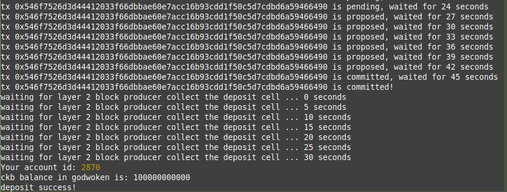

# Task 11: Use a Tron Wallet to Execute a Smart Contract Call

1) A screenshot of the account you created:


2) A link to the Layer 1 address you funded on the Testnet Explorer:
https://explorer.nervos.org/aggron/address/ckt1qyqgz3zd87sgcj66005hlh72tt5m2fexjdjqdqqscu

3) A screenshot of the console  after submission of a CKByte deposit to your Tron account on Layer 2:




4) A screenshot of the console after issuing a smart contract call on Layer 2:


5) The transaction hash from the console output:
```
0x466fc7497489a7f23ea24953486c0fa79a712a98d56e5c5b32cc8af2acfd8634
```
6) The contract address that you called:
```
0x8Df9A59239088d137107e59477f07F1EC549C1e4
```
7) The ABI for contract you made a call on:
```
[
    {
      "inputs": [],
      "stateMutability": "payable",
      "type": "constructor"
    },
    {
      "inputs": [
        {
          "internalType": "uint256",
          "name": "x",
          "type": "uint256"
        }
      ],
      "name": "set",
      "outputs": [],
      "stateMutability": "payable",
      "type": "function"
    },
    {
      "inputs": [],
      "name": "get",
      "outputs": [
        {
          "internalType": "uint256",
          "name": "",
          "type": "uint256"
        }
      ],
      "stateMutability": "view",
      "type": "function"
    }
]
```
8) Your Tron address:
```
TGufwwdvJEBZGTr62UMmBsWVjLTYCYnCos
```
