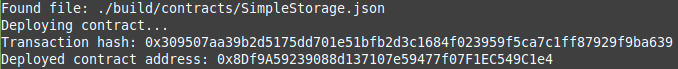

# Task 2: Deploy a Simple Ethereum Smart Contract on Polyjuice

1) A screenshot of contract deployment:

2) Deployed Contract Transaction Hash:
```
0x309507aa39b2d5175dd701e51bfb2d3c1684f023959f5ca7c1ff87929f9ba639
```
3) Deployed Contract address from contract deployment:
```
0x8Df9A59239088d137107e59477f07F1EC549C1e4
```
