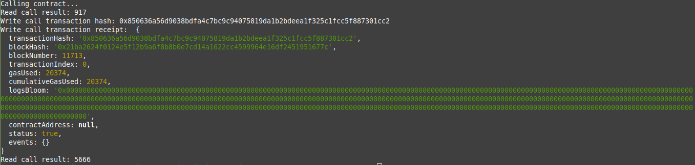

# Task 3: Issue a Smart Contract Call to the Deployed Smart Contract

1) Screenshot of console output of Smart Contract Call:



2) Transaction Hash From Output:
```
0x850636a56d9038bdfa4c7bc9c94075819da1b2bdeea1f325c1fcc5f887301cc2
```
3) Contract Address that was Called:
```
0x8Df9A59239088d137107e59477f07F1EC549C1e4
```
4) ABI for Contract:
```
[
    {
      "inputs": [],
      "stateMutability": "payable",
      "type": "constructor"
    },
    {
      "inputs": [
        {
          "internalType": "uint256",
          "name": "x",
          "type": "uint256"
        }
      ],
      "name": "set",
      "outputs": [],
      "stateMutability": "payable",
      "type": "function"
    },
    {
      "inputs": [],
      "name": "get",
      "outputs": [
        {
          "internalType": "uint256",
          "name": "",
          "type": "uint256"
        }
      ],
      "stateMutability": "view",
      "type": "function"
    }
]

```
