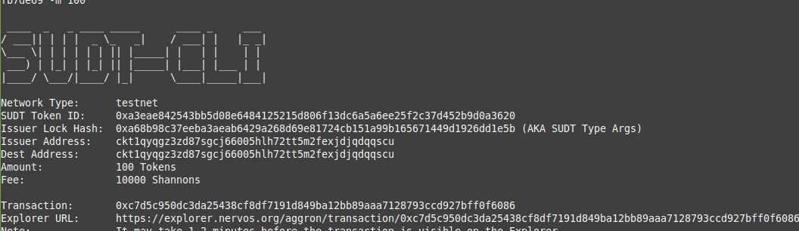
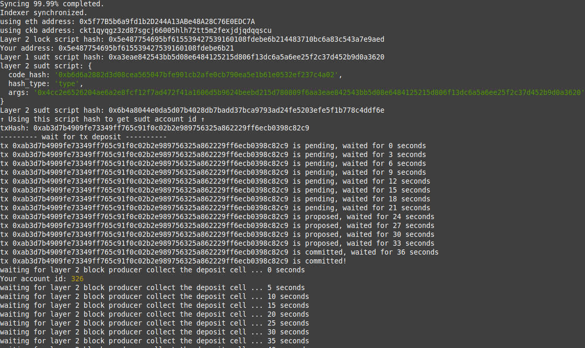
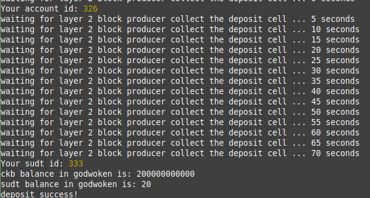

# Task 4: Issue a Smart Contract Call to the Deployed Smart Contract

1) A link to the Layer 1 address you funded on the Testnet Explorer:

https://explorer.nervos.org/aggron/address/ckt1qyqgz3zd87sgcj66005hlh72tt5m2fexjdjqdqqscu

2) A screenshot of the console output immediately after using sudt-cli to create your SUDT tokens on Layer 1:



3) A link to the transaction ID created by sudt-cli on the Testnet Explorer:
https://explorer.nervos.org/aggron/transaction/0xc7d5c950dc3da25438cf8df7191d849ba12bb89aaa7128793ccd927bff0f6086

4) A screenshot of the console output immediately after you have successfully submitted a deposit to Layer 2 using the account-cli tool:



5) The SUDT ID from the console output after executing the deposit script (in text format):
 ```
 SUDT ID: 333
 ```
