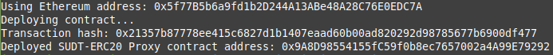
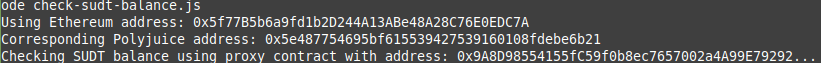

# Task 5: Deploy the ERC20 Proxy Contract for the Deposited SUDT

1) A screenshot of the console output immediately after deploying smart contract:


2) The address of the ERC20 Proxy Contract you deployed (in text format):
```
0x9A8D98554155fC59f0b8ec7657002a4A99E79292
```
3) A screenshot of the console output immediately after checking your SUDT balance:


4) The Ethereum address that was checked (in text format):
```
0x5f77B5b6a9fd1b2D244A13ABe48A28C76E0EDC7A
```
