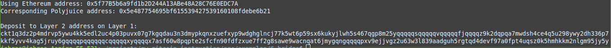

# Task 5: Use Force Bridge to Deposit Tokens From Ethereum to Polyjuice

1) A screenshot of the console output immediately after you have successfully generated your Deposit Receiver Address:


2) Your Deposit Receiver Address (in text format):
```
ckt1q3dz2p4mdrvp5ywu4kk5edl2uc4p03puvx07g7kgqdau3n3dmypkqnxzuefxyp9wdghglncj77k5wt6p59sx6kukyjlwh5s467qgp8m25yqqqqqsqqqqqvqqqqqfjqqqqz9k2dqpqa7mwdsh4ce4q5u298ywy2dh336p7kkf5yvv4kag5jruy6gqqqqpqqqqqqcqqqqqxyqqqqx7asf60w8pqpte2sfcfn90fdfzxue7ff2g8sawe9wacnqat6jmygqngqqqqpxv9ejjvgz2u63w3l839aadguh5rgtqd4devf97a0fpt4uqsz0k5hmhkkm2nlgm95jy5y
```
3) The Ethereum address used to generate the Deposit Receiver Address (in text format):
```
0x5f77B5b6a9fd1b2D244A13ABe48A28C76E0EDC7A
```
4) A link to the Etherscan explorer for the successful Force Bridge transaction:
https://rinkeby.etherscan.io/tx/0xb3a209f1ee7e790b85c386231d81a84f0f5a4f2575bf1014e43b7115e15575fa

5) A link to the Nervos explorer for the successful Force bridge transaction:
https://explorer.nervos.org/aggron/transaction/0x9b91cb22d500e4e5290d379fdd412267f5ff5da4c7572513e8b2f0c446afe936
