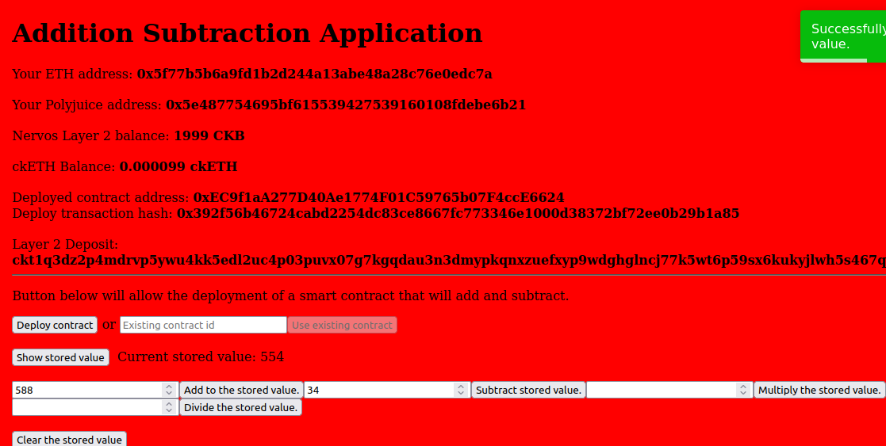
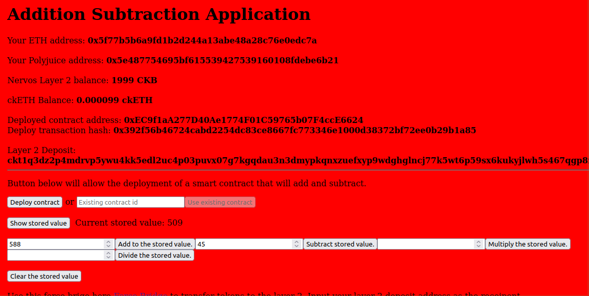
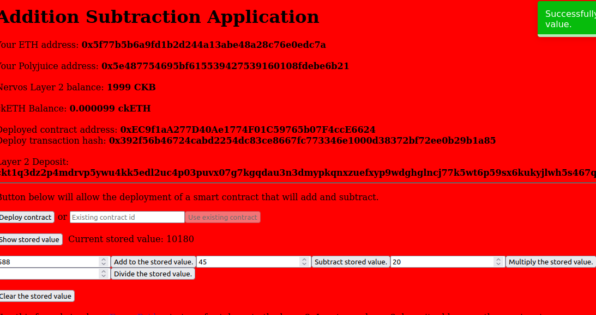

# Task 7: Port an Existing Ethereum dApp to Polyjuice

1) Screenshots of your application running on Godwoken:



# After Subtraction



# After Multiplication




2) Link to the GitHub repository with your application which has been ported to Godwoken.:
https://github.com/MindoLam/Calculator-Nervos-Dapp

3) ABI:
```
[
    {
      "inputs": [],
      "stateMutability": "payable",
      "type": "constructor"
    },
    {
      "inputs": [
        {
          "internalType": "int256",
          "name": "x",
          "type": "int256"
        }
      ],
      "name": "add",
      "outputs": [],
      "stateMutability": "payable",
      "type": "function"
    },
    {
      "inputs": [
        {
          "internalType": "int256",
          "name": "y",
          "type": "int256"
        }
      ],
      "name": "subtract",
      "outputs": [],
      "stateMutability": "payable",
      "type": "function"
    },
    {
      "inputs": [
        {
          "internalType": "int256",
          "name": "w",
          "type": "int256"
        }
      ],
      "name": "divide",
      "outputs": [],
      "stateMutability": "payable",
      "type": "function"
    },
    {
      "inputs": [
        {
          "internalType": "int256",
          "name": "z",
          "type": "int256"
        }
      ],
      "name": "multiply",
      "outputs": [],
      "stateMutability": "payable",
      "type": "function"
    },
    {
      "inputs": [],
      "name": "show",
      "outputs": [
        {
          "internalType": "int256",
          "name": "",
          "type": "int256"
        }
      ],
      "stateMutability": "view",
      "type": "function"
    },
    {
      "inputs": [],
      "name": "clear",
      "outputs": [],
      "stateMutability": "payable",
      "type": "function"
    }
  ]
```
