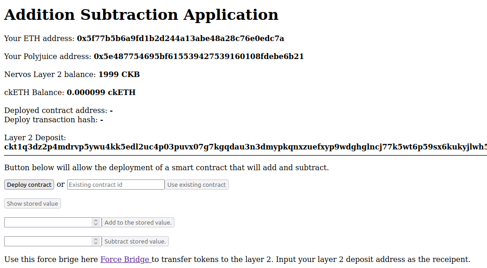

# Task 8: Modify the Ported dApp so it Supports Ethereum Assets via Force Bridge

1) A screenshot or video of your EVM application on Layer 2 with Force Bridge support:



2) The address of the SUDT-ERC20 Proxy Contract that you deployed (in text format):
```
0x56249FCD470313e956d21c5912D3B68E32367ACf
```

3) A link to the GitHub repository with your EVM application that integrates Force Bridge support:

https://github.com/MindoLam/Calculator-Nervos-Dapp/tree/main/ForceBride-Support
