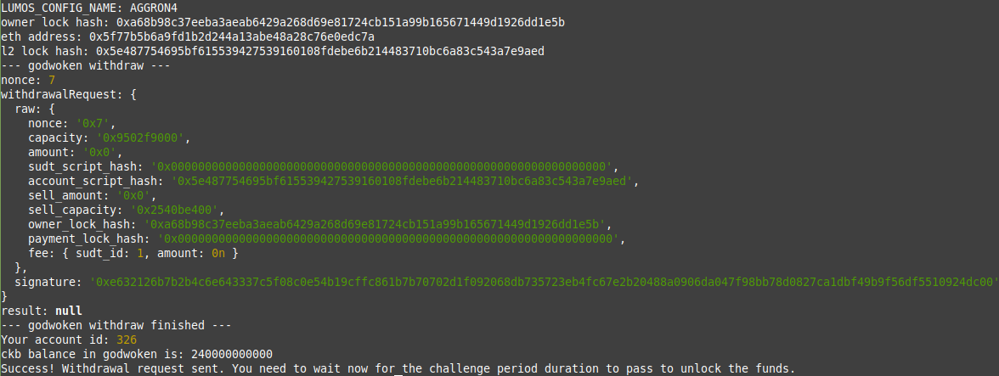

# Task 9: Initiate Withdrawal Process from the Layer 2 back to Layer 1

1) A screenshot of the console output immediately after running the withdraw command:


2) The Ethereum address that you've used for your Layer 2 account (in text format):
```
0x5f77B5b6a9fd1b2D244A13ABe48A28C76E0EDC7A
```
3) The Nervos Layer 1 address that you passed to withdraw command (in text format):
```
ckt1qyqgz3zd87sgcj66005hlh72tt5m2fexjdjqdqqscu
```
